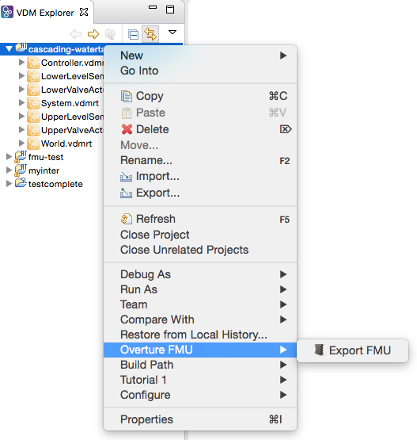

# Overture

The Overture community supports the modelling method *The Vienna Development Method (VDM)* which is a set of modelling techniques that have a long and successful history in both research and industrial application in the development of computer-based systems.

The *Overture Tool* is an open-source integrated development environment (IDE) for developing and analysing VDM models. The tool suite is written entirely in Java and built on top of the Eclipse platform.

## FMI support for Overture

The support for FMI in Overture is based on the Crescendo Tool and an automated export is avaliable when annotating the specification with FMI specific information.

* Note that FMUs running **VDM require variable step size**. If a fixed step size is selected then it may introduce errors. Thus if fixed stepsize is selected make sure that the interval is close to that of the control loop. (Internally VDM runs with nano seconds resolution where each expression is assigned a time cost)*

Overture (VDM) specification can be annotated with interface annotations allowing the modeller to specify which *values* should be *parameters*, and which *instance variables* should be *inputs* or *outputs*.

The annotation format is as follows:

```
-- @ interface: type = [input/output/parameter], name="...";
```
it must be located exactly above a value or instance variable.

### Parameter Annotations

A parameter annotation can only be used with VDM values as shown here: 

```
values
-- Hardware IO parameters aka - Shared Design Parameters
-- @ interface: type = parameter, name="maxlevel1";
public maxlevel1 : real = 2.0; -- {m}
```
The annotation can be used on any value in any class.

### Input & Output Annotations

An input or output annotation can only be used on instance variables as shown here:


```
system System

-- Hardware IO definitions
instance variables
	
-- @ interface: type = input, name="level1";
    public static upperlevel   : real := 0.0;
 
-- @ interface: type = output, name="valveState1";   
    public static upperValveState : bool := false;
```

**Note that the annotation is only supported in the `system` class.

## Installing the FMI Exporter for Overture

The plugin can be installed from: [http://overture.au.dk/into-cps/vdm-tool-wrapper/development/latest/ide/repository/target/repository/](http://overture.au.dk/into-cps/vdm-tool-wrapper/development/latest/ide/repository/target/repository/)

## Exporting an annotated specification

The export can be started from the context menu in the Overture Explorer -> Overture FMU -> FMU Export



The export fill place a `.fmu` in the project folder on completion and list the export progress in the console like: 

```
---------------------------------------
|             FMU Export              |
---------------------------------------
Starting FMU export for project: 'cascading-watertank'
Found annotated definition 'Controller.maxlevel1' with type 'parameter' and name 'maxlevel1'
Found annotated definition 'Controller.minlevel1' with type 'parameter' and name 'minlevel1'
Found annotated definition 'Controller.maxlevel2' with type 'parameter' and name 'maxlevel2'
Found annotated definition 'Controller.minlevel2' with type 'parameter' and name 'minlevel2'
Found annotated definition 'System.upperlevel' with type 'input' and name 'level1'
Found annotated definition 'System.lowerlevel' with type 'input' and name 'level2'
Found annotated definition 'System.upperValveState' with type 'output' and name 'valveState1'
Found annotated definition 'System.lowerValveState' with type 'output' and name 'valveState2'
Found system class: 'System'
Setting generation data to: 2016-01-07T09:27:55
```

Followed by a printout of the `modelDescription.xml` file it generates.

## Manual Export

See this page for [manual](overture.html) export.

